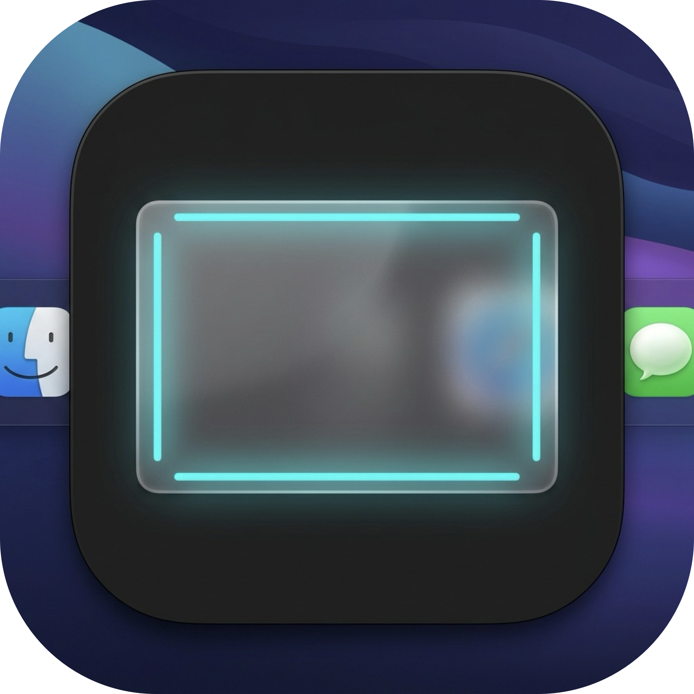
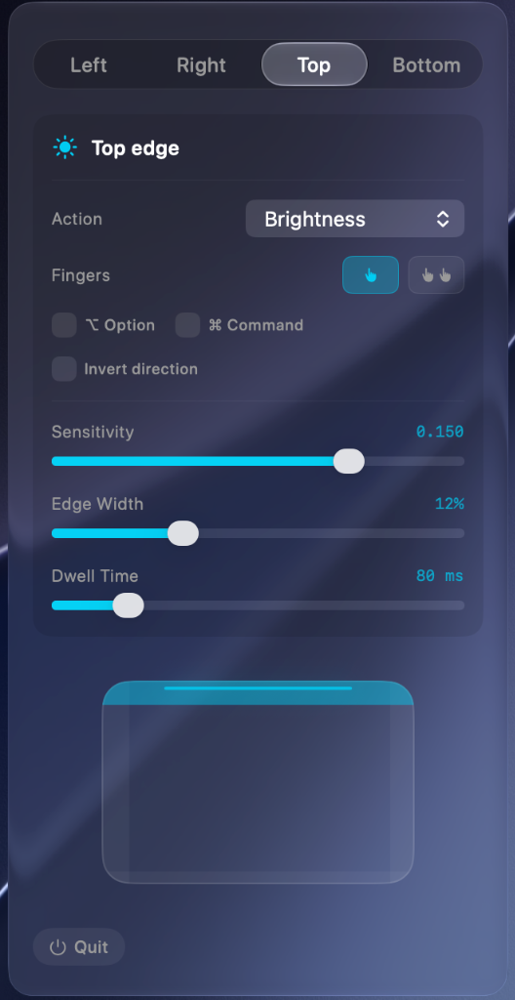
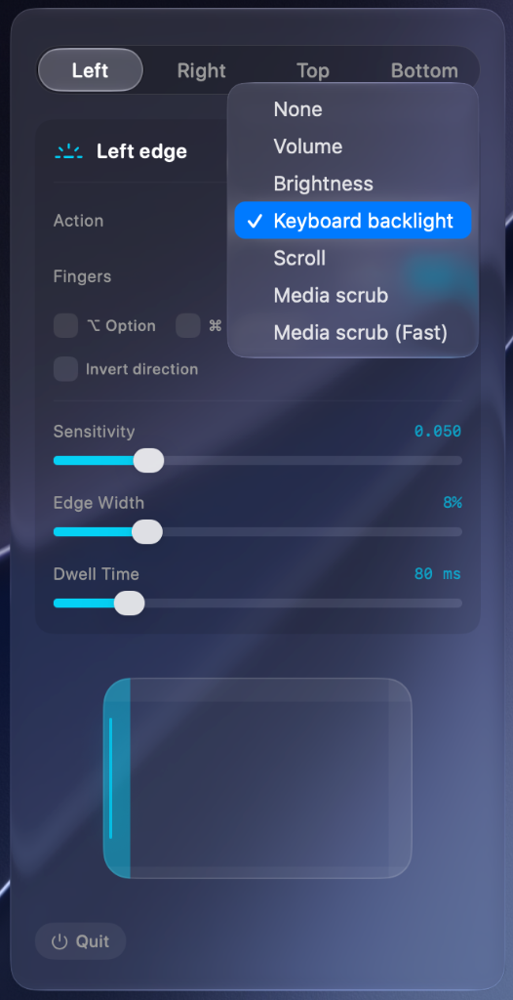
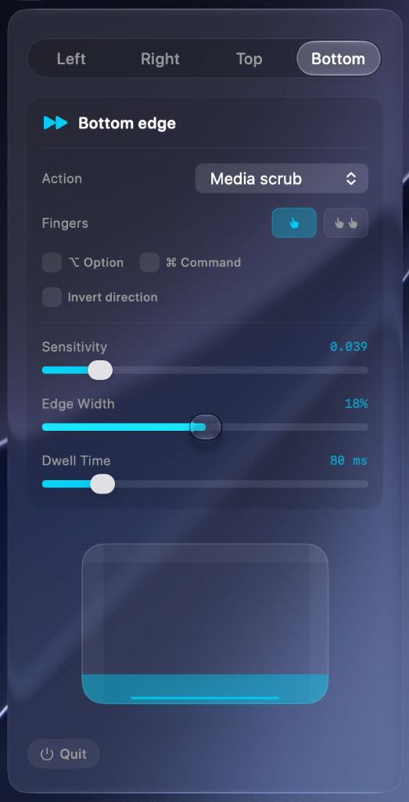
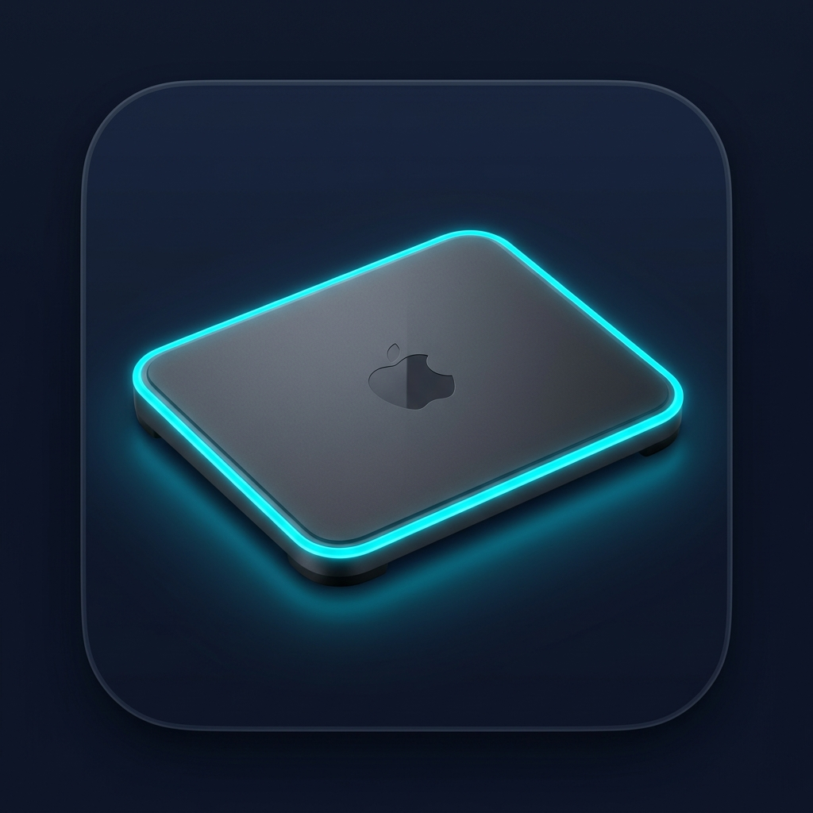
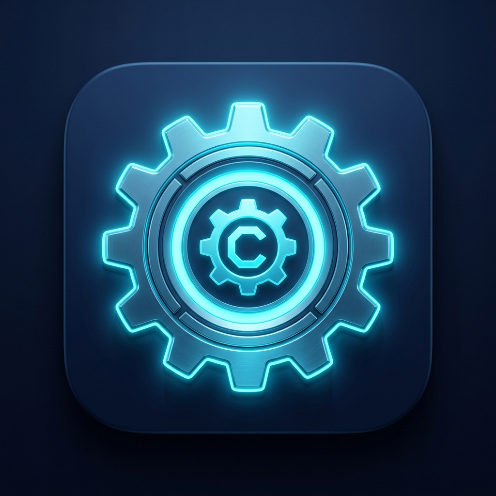
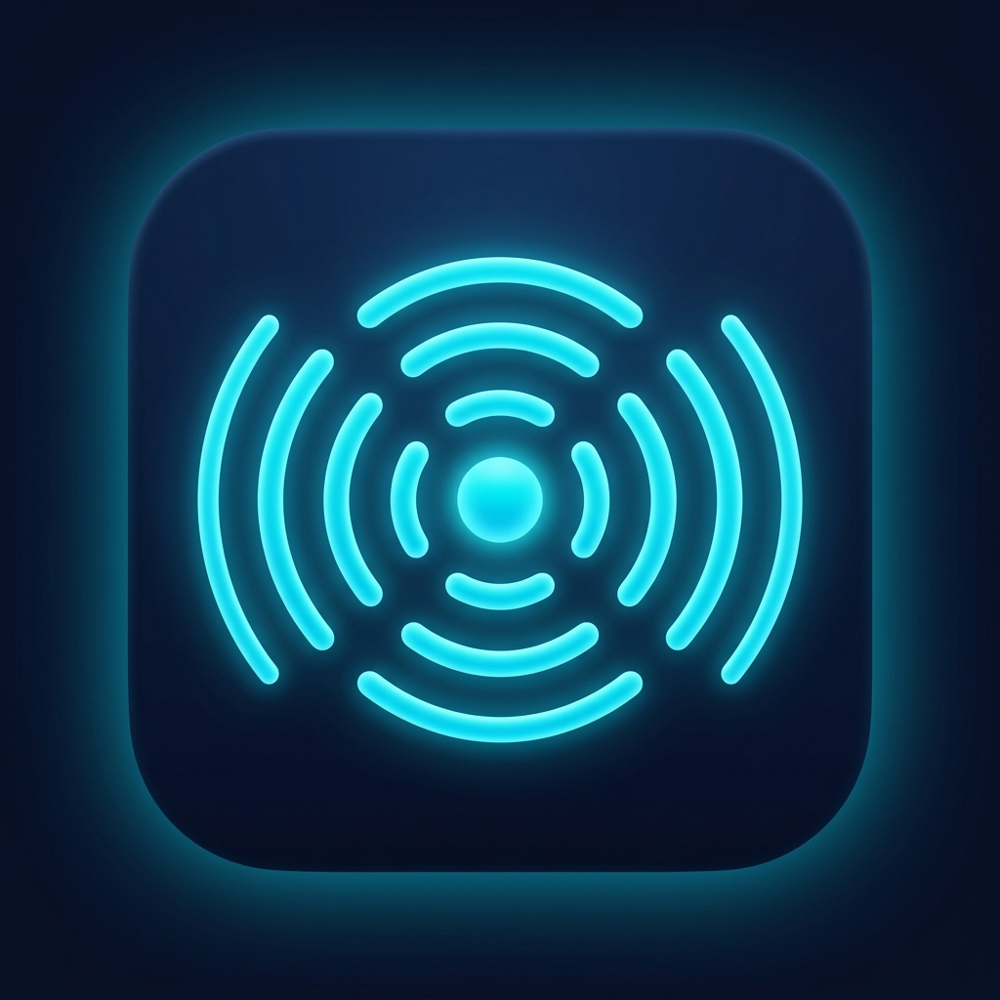
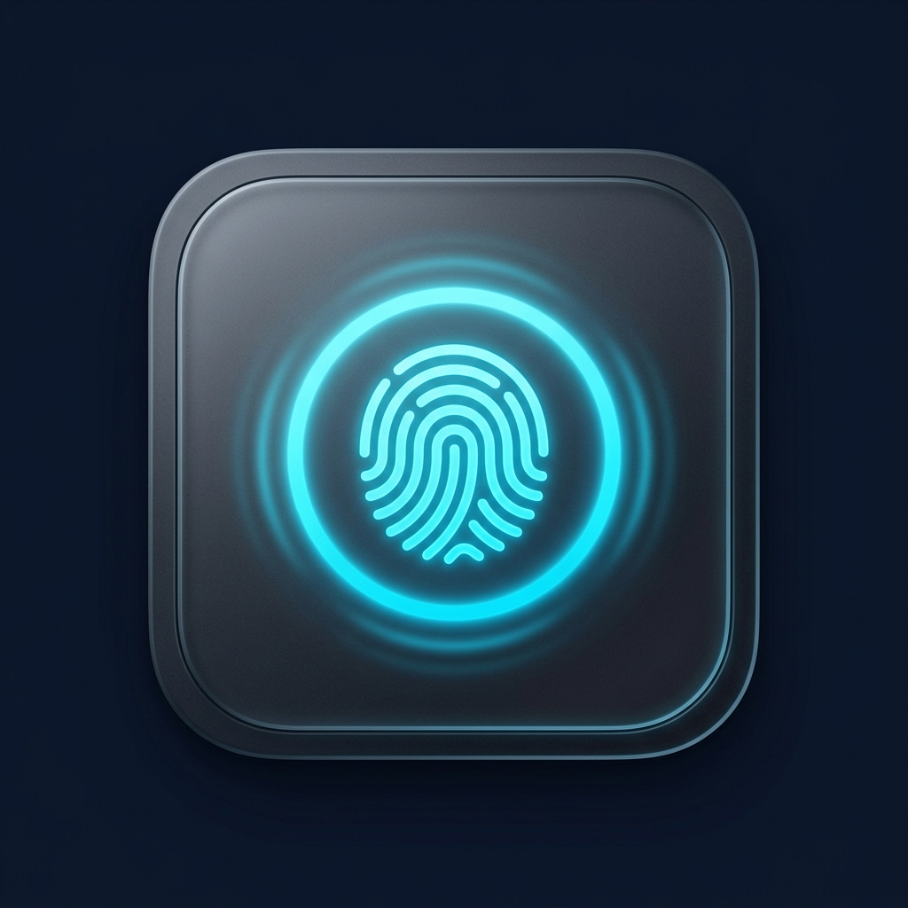
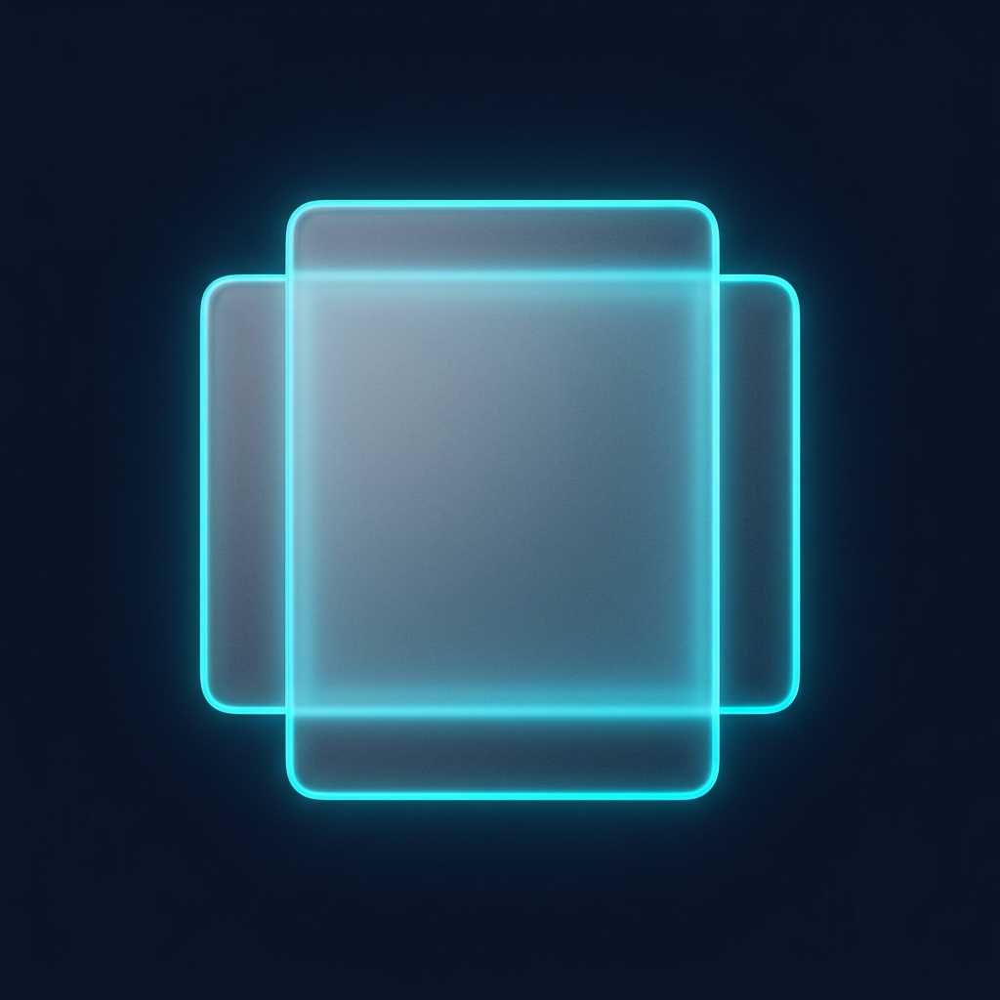
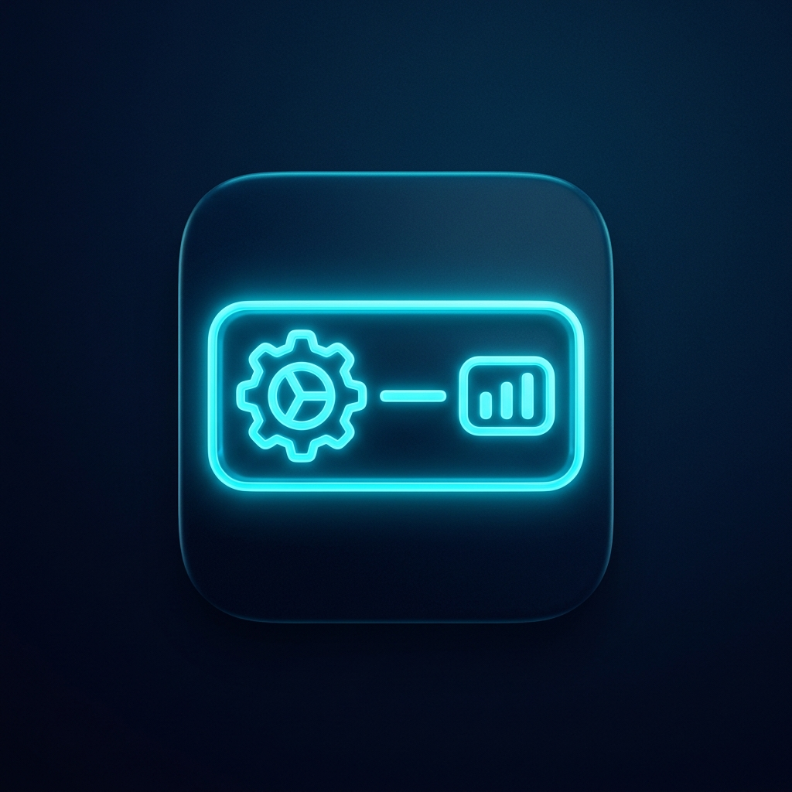

<!-- ═══════════════════════════════════════════════════════════════════════
     EdgePad — README
     Design: Dark OLED + Glassmorphism · Accent: Cyan #00CCF2
     ═══════════════════════════════════════════════════════════════════════ -->

<br/>
<br/>

<div align="center">


<br/><br/>

# **E D G E P A D**

**Turn your trackpad edges into powerful system controls.**

<sub>Slide along any edge of your MacBook trackpad to control volume, brightness, media playback, and more — no buttons, no shortcuts, just natural gestures.</sub>

<br/>

<a href="https://github.com/X377AAHIL/EdgePad/releases/latest"></a>

<br/>
<br/>


&nbsp;

&nbsp;

&nbsp;


</div>

<br/>
<br/>

<!-- ─── APP SCREENSHOTS ─── -->

<p align="center">
  
  &nbsp;&nbsp;
  
  &nbsp;&nbsp;
  
</p>

<br/>

---

<br/>

<!-- ─── FEATURES ─── -->

<h2 align="center"><kbd>&nbsp;Features&nbsp;</kbd></h2>

<br/>

<table align="center">
  <tr>
    <td align="center" width="280">
      <br/><br/>
      <h4>4 Edge Zones</h4>
      <sub>Left · Right · Top · Bottom — each independently configurable</sub>
    </td>
    <td align="center" width="280">
      <br/><br/>
      <h4>7 Actions</h4>
      <sub>Volume · Brightness · Keyboard Backlight · Scroll · Media Scrub · Fast Scrub</sub>
    </td>
    <td align="center" width="280">
      <br/><br/>
      <h4>Haptic Feedback</h4>
      <sub>Tactile click on every step so you feel the change</sub>
    </td>
  </tr>
  <tr><td colspan="3">&nbsp;</td></tr>
  <tr>
    <td align="center" width="280">
      <br/><br/>
      <h4>Touch Visualizer</h4>
      <sub>Real-time finger tracking with edge-band overlays</sub>
    </td>
    <td align="center" width="280">
      <br/><br/>
      <h4>Glassmorphic UI</h4>
      <sub>Liquid Glass on macOS 26 · frosted fallback on older systems</sub>
    </td>
    <td align="center" width="280">
      <br/><br/>
      <h4>Menu Bar Only</h4>
      <sub>Zero dock clutter — lives quietly in your menu bar</sub>
    </td>
  </tr>
</table>

<br/>

---

<br/>

<!-- ─── ACTIONS ─── -->

<h2 align="center"><kbd>&nbsp;Actions&nbsp;</kbd></h2>

<p align="center"><sub>Each trackpad edge can be assigned any of these:</sub></p>

<br/>

<div align="center">

| Action | What It Does | Direction |
|:------:|:------------:|:---------:|
| **Volume** | System audio up / down | Vertical |
| **Brightness** | Display brightness up / down | Horizontal |
| **Keyboard Backlight** | Backlight intensity up / down | Either |
| **Scroll** | Scroll content in any app | Vertical |
| **Media Scrub** | Skip forward / backward | Horizontal |
| **Media Scrub (Fast)** | Jump with Option + Arrow | Horizontal |

</div>

<br/>

---

<br/>

<!-- ─── TIP ─── -->

<h2 align="center"><kbd>&nbsp;Avoid Accidental Palm Triggers&nbsp;</kbd></h2>

<p align="center">
  <sub>If gestures fire while typing because your palm rests on the trackpad:</sub>
</p>

<br/>

<div align="center">

| Fix | How |
|:---:|:---:|
| 👆👆 **Use 2-finger mode** | Set **Fingers** to **2** — a resting palm won't trigger it |
| **Add a modifier key** | Enable **Option** or **Command** — gestures only fire while the key is held |

</div>

<p align="center">
  <sub>Both options are per-edge — mix and match depending on which edge you use most.</sub>
</p>

<br/>

---

<br/>

<!-- ─── INSTALL ─── -->

<h2 align="center"><kbd>&nbsp;Installation&nbsp;</kbd></h2>

<br/>

<div align="center">

**[Download EdgePad.dmg](https://github.com/X377AAHIL/EdgePad/releases/latest)**

</div>

```
1 · Open the DMG
2 · Drag EdgePad into Applications
3 · Launch from Applications
4 · Grant Accessibility when prompted
```

<details>
<summary><b>Build from source</b></summary>

```bash
git clone https://github.com/X377AAHIL/EdgePad.git
cd EdgePad
xcodebuild -project EdgePad.xcodeproj -scheme EdgePad -configuration Release build
```

</details>

<br/>

---

<br/>

<!-- ─── PERMISSIONS ─── -->

<h2 align="center"><kbd>&nbsp;Permissions&nbsp;</kbd></h2>

<p align="center"><sub>EdgePad reads raw trackpad touches, which macOS treats as privileged input.</sub></p>

<br/>

<table align="center">
  <tr>
    <td align="center" width="400">
      <h4>Accessibility</h4>
      <code>System Settings → Privacy & Security → Accessibility</code><br/><br/>
      <b>Required</b> — enables system-wide gesture detection
    </td>
    <td align="center" width="400">
      <h4>Input Monitoring</h4>
      <code>System Settings → Privacy & Security → Input Monitoring</code><br/><br/>
      <b>If needed</b> — add EdgePad here if gestures don't register
    </td>
  </tr>
</table>

<br/>
<br/>

---

<p align="center">
  Made with care by <a href="https://github.com/X377AAHIL"><b>Aahil Shaarav G</b></a>
</p>
<p align="center">
  <sub>© 2026 Aahil Shaarav G · All rights reserved</sub>
</p>
