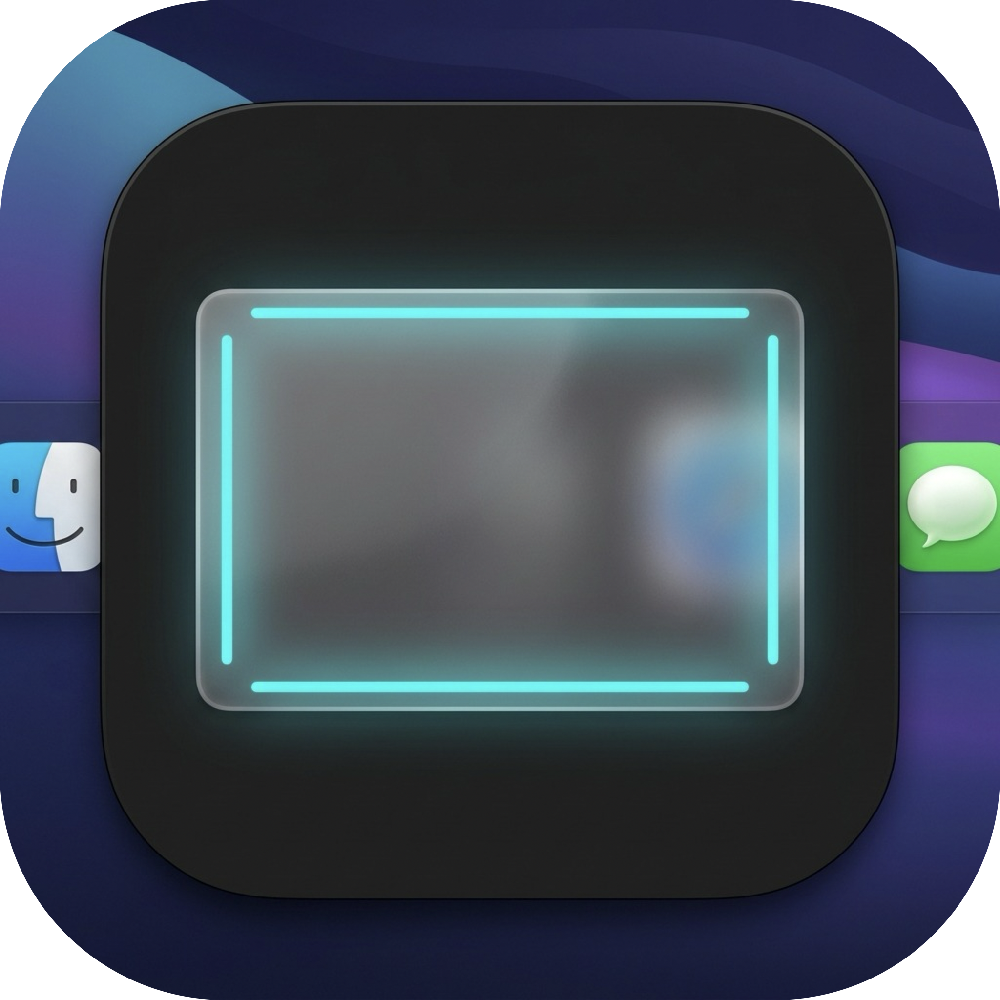
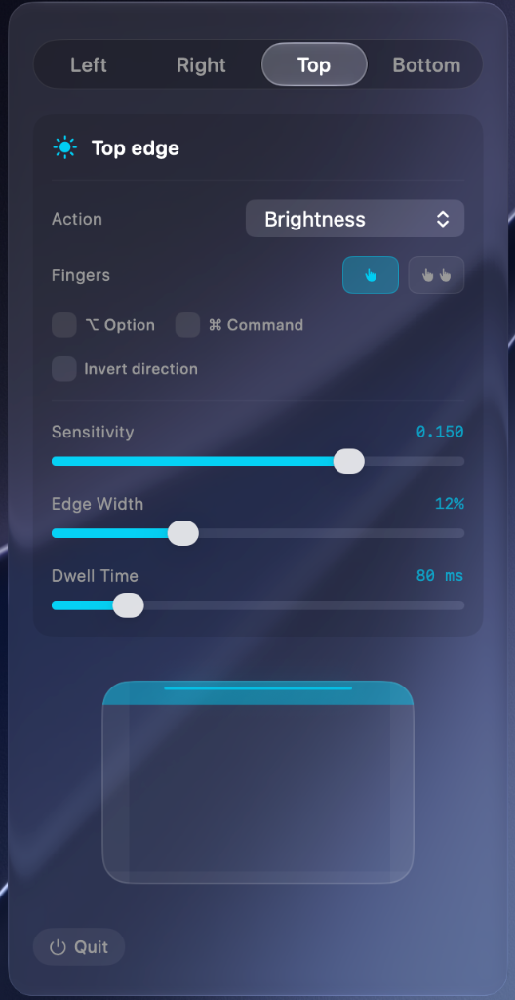
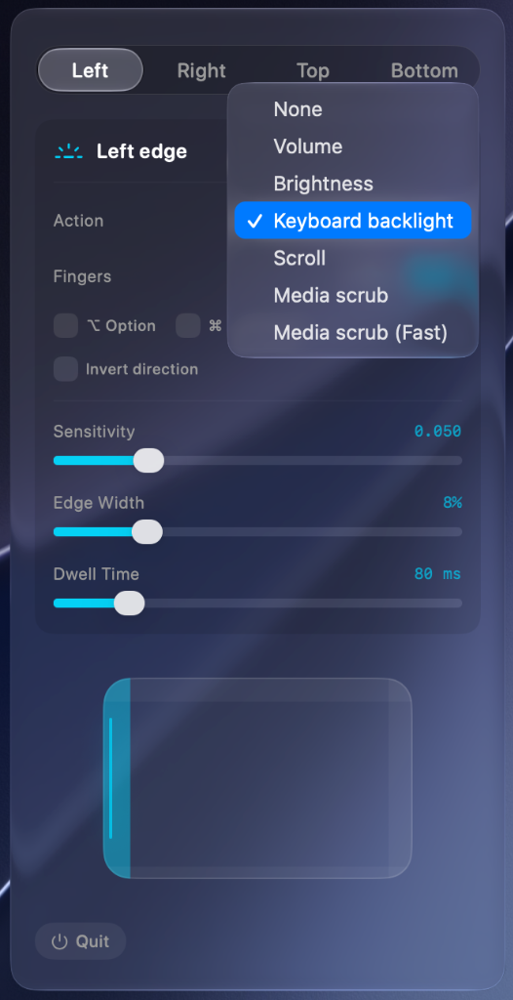
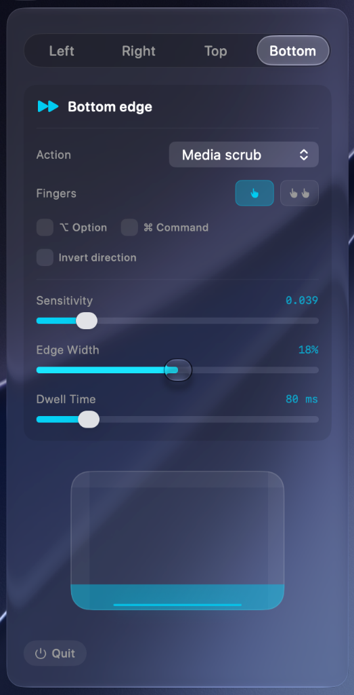

<!-- ═══════════════════════════════════════════════════════════════════════
     EdgePad — README
     Design: Dark OLED + Glassmorphism · Accent: Cyan #00CCF2
     ═══════════════════════════════════════════════════════════════════════ -->

<div align="center">



<br/>

<h1><big><strong>EdgePad</strong></big></h1>

<p><b>Turn your Mac trackpad edges into powerful system controls.</b></p>
  
<p>Slide along any edge of your MacBook trackpad to effortlessly control volume, brightness, media playback, and more — no buttons, no shortcuts, just natural gestures.</p>

<br/>

<a href="https://github.com/X377AAHIL/EdgePad/releases/latest">
  
</a>

<br/><br/>


&nbsp;

&nbsp;

&nbsp;


</div>

<br/>

## Interface

<p align="center">
  
  &nbsp;
  
  &nbsp;
  
</p>

<br/>

## ✨ Key Features

- 🎛️ **4 Independent Edge Zones** — Configure Left, Right, Top, and Bottom edges with unique actions.
- 🚀 **7 Powerful Actions** — Adjust Volume, Brightness, Keyboard Backlight, Scroll, and Scrub Media.
- 📳 **Haptic Feedback** — Feel every adjustment with tactile clicks powered by your MacBook's Taptic Engine.
- 👁️ **Touch Visualizer** — Real-time finger tracking with sleek edge-band overlays.
- 🎨 **Glassmorphic UI** — Stunning native macOS design with frosted glass and liquid blur effects.
- 🕊️ **Unobtrusive & Lightweight** — Runs quietly in your Menu Bar with zero Dock clutter.
- 🔒 **Privacy First** — 100% local. No data tracking, no internet connection required.

<br/>

## 🛠️ Actions & Gestures

Assign any of these actions to any edge. 

| Action | Description | Gesture Direction |
| :--- | :--- | :---: |
| 🔊 **Volume** | Precisely control system audio level | Vertical |
| ☀️ **Brightness** | Adjust main display brightness | Horizontal |
| ⌨️ **Keyboard Backlight** | Fine-tune keyboard illumination | Either |
| 🖱️ **Scroll** | Smoothly scroll content in any application | Vertical |
| ⏪ **Media Scrub** | Skip forward or backward in media | Horizontal |
| ⏭️ **Media Scrub (Fast)**| Fast-forward/rewind using Option + Arrow | Horizontal |

<br/>

> **💡 Pro Tip: Avoid Accidental Palm Triggers**
> 
> If your palm accidentally triggers actions while typing, you have two great solutions:
> 1. **2-Finger Mode:** Set *Fingers* to `2`. A resting palm won't trigger the action.
> 2. **Modifier Keys:** Enable `Option (⌥)` or `Command (⌘)`. The gesture will only activate when you hold the key.
> 
> *Both options are per-edge — mix and match depending on which edge you use most!*

<br/>

> **💡 Pro Tip: Comfortable 2-Finger Gestures**
> 
> When using 2-finger mode, you don't need to place your fingers side-by-side (which can strain your wrist). Instead, try placing one finger behind the other for a more natural, effortless swipe!
> - Just ensure both fingers are inside the edge's hitbox.
> - If the gesture isn't responding, try increasing the **Edge Width** in settings to give yourself more room.

<br/>

## 📦 Installation

### Option A: Homebrew (Recommended)
The easiest way to install and keep EdgePad updated.
```bash
brew install --cask X377AAHIL/edgepad/edgepad
```

### Option B: Manual Download
1. Download the latest **[`EdgePad.dmg`](https://github.com/X377AAHIL/EdgePad/releases/latest)**.
2. Open the DMG and drag **EdgePad** to your `Applications` folder.
3. *Note: Since EdgePad is not yet notarized by Apple, you must run this command in Terminal before launching:*
   ```bash
   xattr -cr /Applications/EdgePad.app
   ```
4. Launch EdgePad from Applications and grant the requested permissions.

<details>
<summary><b>🛠️ Build from Source</b></summary>

```bash
git clone https://github.com/X377AAHIL/EdgePad.git
cd EdgePad
xcodebuild -project EdgePad.xcodeproj -scheme EdgePad -configuration Release build
```
</details>

<br/>

## 🔐 Permissions Explained

EdgePad requires specific system permissions to intercept trackpad touches and control system settings. 

- **Accessibility:** *(System Settings → Privacy & Security → Accessibility)*  
  **Required.** Allows EdgePad to detect gestures anywhere on the system and perform actions like simulating media keys.
- **Input Monitoring:** *(System Settings → Privacy & Security → Input Monitoring)*  
  **If needed.** Some macOS versions may require this to accurately read raw trackpad data.

<br/>

## 🧹 Uninstallation

macOS does not automatically clean up app data when you drag an app to the Trash. To completely remove EdgePad:

**Via Homebrew:**
```bash
brew uninstall --cask edgepad
```

**Via In-App Uninstaller (Recommended):**
1. Click the EdgePad Menu Bar icon.
2. Hold the `Option (⌥)` key.
3. Select **Uninstall EdgePad...**
*(This completely removes all preferences, login items, permissions, and deletes the app).*

<br/>

---
<div align="center">
  <p>Made with ❤️ by <a href="https://github.com/X377AAHIL"><b>X377AAHIL</b></a> and AntiGravity 😉</p>
  <p><sup>© 2026 X377AAHIL · All rights reserved</sup></p>
</div>
